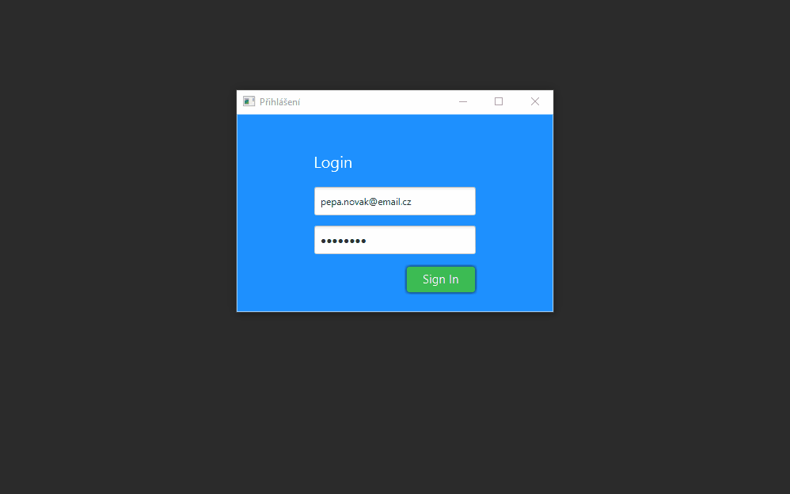

# JavaFX CRM application - User Management

<p align="left">
    
    
    
    
    
    
    
</p>

<p align="left">
    
    
    
</p>

# Project Description
This is a prototype of a simple JavaFX CRM application with in-memory database. The goal of this GIT repository is to create several exactly the same CRM enterprise applications with the same functionality and combined with different frameworks. I will then compare and evaluate these versions against each other
* ease of implementation
* performance
* application size and the need for third-party dependencies (less is better)

In this animated GIF you can see the basic functionality that must be met in all versions (listed below):
* a login window with the ability to log in and authorize users. 
* Communication with the database. Password and user roles are stored in the database.
* Support for CRUD operations, i.e. create/read/update/delete user accounts
* Support for localization, i.e. switching between languages
* in the future I am considering implementing an HTTP REST client for communication with external services, or an AMQP client for communication with a message broker. 



# Current implementation
## JavaFX + Spring + reactor
* Migration to Java 11 and Spring Boot 2 was possible thanks to this tiny, yet powerful [JavaFX Weaver library](https://github.com/rgielen/javafx-weaver)
* run with ```clean install spring-boot:run``` 
* or just ring ```CrmApplication.java``` from your IDE

# Future plans
## JavaFX + Quarkus + Mutiny
//TODO

## JavaFX + JDBC + rxjava
// TODO

## JavaFX + JDBC, compiled into native image with GraalVM
//TODO